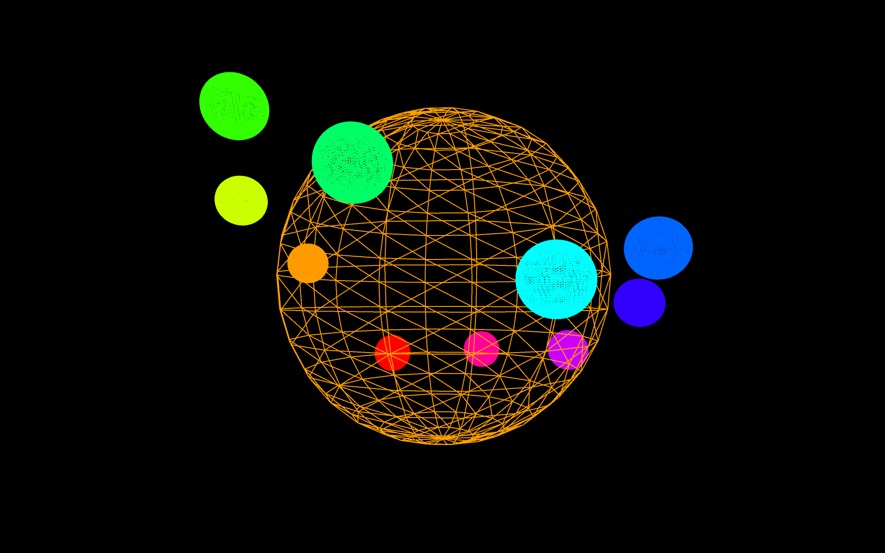

# Music Visualiser Project
# Youtube video of the project

---
# Group Members
| Name | Student Number |
|-----------|-----------|
|Luke Kiernan | C21411466 |
|Hao Lin | C21325063 |
|Vilim Mikic | C21737525 |
---
---
# Description of the assignment
- In this assignment, we have 2 visualisations each using Java processing.
Visualisations are based on the music track from the movie "Trainspotting" by Underworld. Track name is "Born Slippy". Visualisations are made to respond to the amplitude of the music and frequency bands. Audio analysis is done using the Minim library. 
---
# Instructions
- compile and run main.java from ie.tudublin package
- press space bar to restart the track
- **Notice** : visualisations will change automatically at certain parts of the track
- Track time - visualisations changes {31, 58, 76, 99, 167, 205, 300} seconds respectively
- In order of appearance = {HaoWave, VilimsVisual, LukeVisual, HaoCube, LukeVisual2, HaoCube2, VilimSsphere}

<!-- - Visualisations order: 
	1 - hw 5 HaoWave 0:00 - 0:45,
	2 - vv 0 VilimsVisual 0:45 - 1:10, 
	3 - lv 3 LukeVisual 1:10 - 1:35, 
	4 - hc 2 HaoCube 1:35 - 2:23, 
	5 - lv2 4 LukeVisual2 2:23 - 2:57, 
	6,  hc2 6 HaoCube2 2:57 - 3:25,  
	7-  vs 1 VilimSsphere 3:25 - 3:47,  -->
---
# How it works
- Each team member has its own directory containing the visualisations. 
- Aggregate file GroupVisual.java is used to run the visualisations, initialise the music, create the objects and call the methods from the visualisations. This file has been moved to ie.tudublin package for convenience.

## Vilim Mikic
- I created 2 visualisations. The first one is combination of 2D and 3D shapes. 
- The first visualisation is split in two parts. The first part is the outer circle in which the sticks represent the amplitude of the sound. At the end of each stick is an arc(half circle). Thanks to year 3 student to help me with maths(I find it hard to visualise sin and cos for some reason). The 2nd part of this visualisation is a sphere which rotation speed is base on the amplitude of the sound. The colour is based on the SmoothedAmplitude(comes from GroupVisual class).

- The second visualisation is made up of 3D spheres. It is made up of a large very low-res sphere and smaller high-res spheres. The large sphere is intentionally low-res, so smaller spheres can be seen at all times. It doesn't look very round, since spheres in Processing library are just tesselated triangles(polygons). The colour and rotation speed is based on the amplitude of the sound.
- Small spheres are much higher res, so they look smoother. The number of spheres and colour is based on the frequency bands, rotation is based on the amplitude, as well as the bounce of the spheres.

## Luke Kiernan
- I also created 2 visualisation. The first visuliation is is a i series of collums based off the frequency bands, they react to the amplitude of the music and rotate around the center on a constant rotation

- The second visuliation contains 2 parts a star like object in the middle of the screen and the background. The star size changes based on the amplitude of the song the angles of the lines change based on the amplitude. The lines also change based on the frequency. The backgound draws particles randomly and they move around the screen.

## Hao Lin
- 3 visualization created.
- First one is a 3D visualization of cubes moving toward the screen and regenerate at the far end after they disappear, the speed and colour of cubes is based on the amplitude of the song. A class for cube is created to store information about each specific cube and then an ArrayList of cube is created to store all cubes.

- Second visualization comes from coincidence during my debugging of first scene. it's based on cubes from first visualization, what the difference is that the x and y coordinate of cubes is fixed and cubes are getting bigger with the changing of z-coordinate. The change of z value is base on the amplitude of the song.

- Third visualization is galaxy-like scene consist by a big circle with lines come out from edge of the circle on the center and mutiple small circles rotating around the central circle. The size and color of lines for the middle circle is based on the amplitude of circle. On the outter, speed of smaller circles rotating and distance of smaller circles away from the center is controlled by the amplitude of song. noise function is used to randomize the position of small circles.
 

# What I am most proud of in the assignment

## Hao Lin
- Better understanding on OOP concpets
- Implementation of cube's movement

## Vilim Mikic
- Gaining the understanding of working with 3D objects and how they are actually rendered. Higher density doesnt always look better, from a creative point of view at least.
- Integrating 2D and 3D objects into one scene. That took me a while to figure it out, but was a fun journey.
- Working with a team for the first time and generally collaborating to solve problems. 
- Finally, stepping up to lead the team, making sure that progress is being made and that project isn't done as a last minute effort.
- Thanks for putting up with me me guys <3

